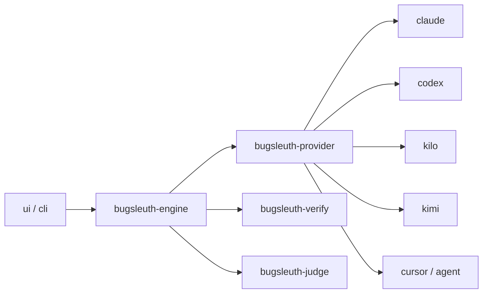

# BugSleuth — AI Context

## System Overview

BugSleuth runs multi-lane code reviews through signed-in coding CLIs (not metered HTTP APIs), verifies every finding against the repository, then judges agreement across models. Two front ends share one engine: `bugsleuth-cli` and the Tauri desktop app.

## Tech Stack & Architecture

Rust workspace (`bugsleuth-domain`, `provider`, `verify`, `judge`, `engine`, `cli`) plus Tauri (`src-tauri`) and a vanilla TypeScript UI (`ui/`). Vendor differences live only in `bugsleuth-provider` as a closed `Vendor` enum, not a trait.

## Component Map

- `crates/bugsleuth-provider/src/{claude,codex,kilo,kimi,cursor}.rs` — one subprocess adapter per CLI
- `crates/bugsleuth-engine/src/sweep.rs` — `Vendor::parse`, isolation, invoke
- `crates/bugsleuth-engine/src/sweep/isolate.rs` — strip project instruction files from throwaway worktrees
- `src-tauri/src/catalogue.rs` + `ui/src/{model,cli-offer,view}.ts` — vendor menus (`VENDORS` must stay in step); menus filter on `models::cli_installed` / `VendorModels.installed`

## Data Flow

Config (`vendor:model` specs) → plan units → per-vendor precheck → isolated sweep → anchor verify → judge → report / apply handoff.

Cursor specs look like `cursor:composer-2.5`. The CLI binary users type is `agent`; BugSleuth prefers the install tree's `node.exe` + `index.js` over the Windows `.cmd` shim. Sweeps use `-p --mode ask --trust`; applies use `-p --force --trust`.

## Recent Context & Decisions

- 2026-08-12: Codex repository review is refused at `plan` and removed from default/balanced/deep presets; Codex remains available for apply. UI `canRun` disables matrices that still list `codex:` sweep rows.
- 2026-08-12: Instruction strip and Cursor `find_instruction` classify entries with `symlink_metadata` + Windows reparse-point check before recurse/delete; instruction-named links are unlinked without following (Windows junctions used to fail `remove_file` with Access Denied).
- 2026-08-12: Released **0.2.48** — sweep/run share 2700s timeout and Claude 40-turn defaults; triage reasons/acks sanitized with `printable`; Cursor apply refuses nested/case-folded instruction files; inventory write asserts known-present names; verify installs pre-push hook; shared `check-test-inventory.sh`.
- 2026-08-12: Sweep/run share `DEFAULT_SWEEP_TIMEOUT_SECS` (2700) and `DEFAULT_CLAUDE_MAX_TURNS` (40). Triage `triage_reason`/`acknowledged` pass through `printable` at storage and report render. Cursor apply walks the tree (case-insensitive) for `.cursorrules`/`agents.md`/`cursor.md`/`.cursor`/`.agents`. Inventory write asserts known-present names + refuse large count drops; `check-test-inventory.sh` is the shared gate path; verify installs the pre-push hook via `git rev-parse --git-path`.
- 2026-08-12: Released **0.2.47** — Cursor apply refuses repos that ship `.cursorrules`/`AGENTS.md`/`.cursor`/`.agents` (no ignore-rules flag); hermetic Kimi catalogue/discovery tests; `verify.sh` runs `test-verify-lock.sh`; update UI clears checking spinner before install confirm.
- 2026-08-12: Released **0.2.46** — bound embedded JSON brace recovery; per-platform `tests.lock.*` so linux/macos no longer skip the missing-test gate.
- 2026-08-12: Test inventory gate uses `tests.lock.$(platform)` (windows/linux/macos) instead of one shared `tests.lock` that skipped comparison on non-recording OSes. Refresh via `scripts/test-inventory.sh` or `.github/workflows/test-inventory.yml`.
- 2026-08-12: `parse_embedded` bounds brace-start recovery (`MAX_BRACE_STARTS` / `MAX_EMBEDDED_CHARS`) so brace-heavy model replies cannot burn unbounded CPU.
- 2026-08-12: Provider menus and Check sign-in gate on a cheap local CLI install check (`models::cli_installed` / each vendor's `binary_path`) before catalogue fetches or model probes. Dropdowns only offer installed vendors (plus a stale saved selection so it can be changed); uninstalled CLIs still appear as status pills.
- 2026-08-12: Added Cursor Agent CLI (`agent`) as vendor `cursor`. Ask mode is the write boundary; worktree isolation remains because there is no ignore-rules flag. Effort is encoded in model ids (no separate effort flag). No schema enforcement — brief describes JSON shape.
